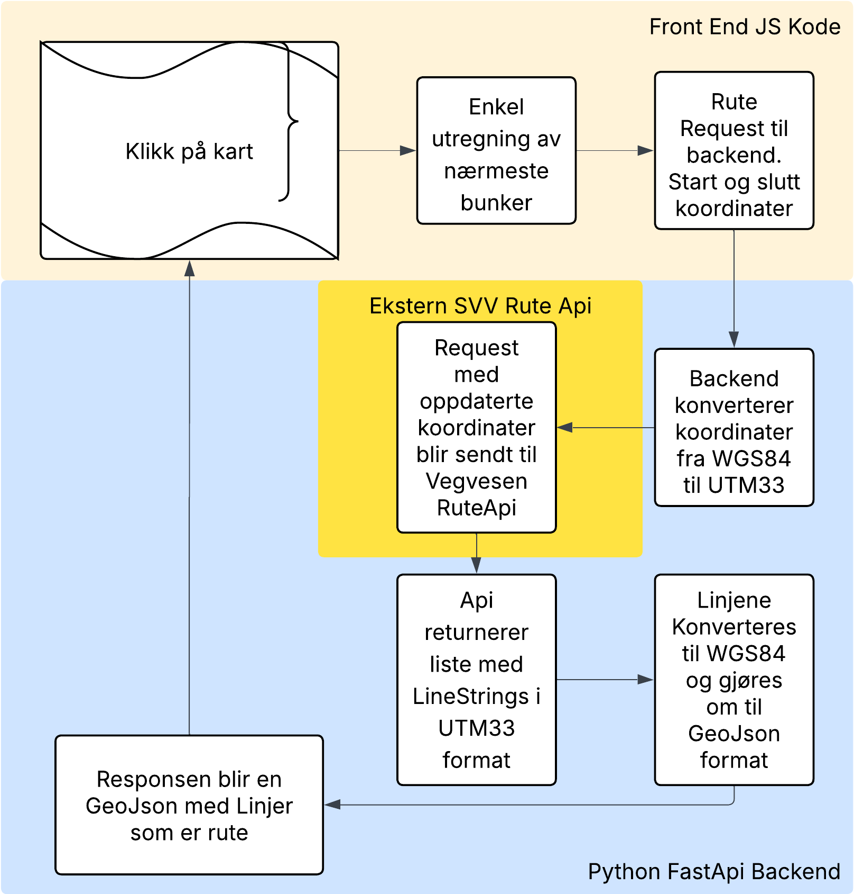

# IS-218-GIS

## TLDR: System
Systemet viser korteste rute til en tilfluktsrom fra brukerens posisjon, samt klikket posisjon. Lister opp nærmeste tilfluktsrom sortert etter distanse (luftlinje). Kan vise både varmekart over høyde og bruk av areal på kartet.

## API Kart



## Video of the application
https://github.com/user-attachments/assets/ffff3346-065e-40ad-a9b8-c8621c3541c3

## Dependencies

- **Python:** `3.14`
- **Pip packages:** listed in `requirements.txt`

## Setup & Run

From the fastapiapp directory, run:

```bash
pip install -r requirements.txt --force-reinstall --no-deps

python main.py

/
py -m pip install -r requirements.txt --force-reinstall --no-deps

py main.py

```


## 🧱 Teknisk Stack

### Backend
- Python 3.14
- FastAPI

### Frontend
- HTML5
- JavaScript (ES6)
- Leaflet
- CSS3

### Datakilder & tjenester
- GeoNorge WFS
- GeoNorge / Kartverket WMS
- NVDB API (Statens vegvesen)
- GeoJSON


## 🗺️ Arkitektur

## 📂 Datakatalog

| Datasett | Kilde | Format | Bearbeiding |
|--------|------|--------|-------------|
| Tilfluktsrom Liste | WFS Geonorge | XML features | XML gjort om til GeoJson med WGS84 (EPSG:4326) koordinater |
| WMS lag | GeoNorge / Kartverket | WMS PNG | Hentes direkte med WMS |
| Vegnett (NVDB) | NVDB API (Statens vegvesen) | JSON (WKT / UTM33) | Parsing av JSON, konvertering fra WKT til GeoJSON og reprojisering til WGS84, Blir lagret som GeoJson |


## 🧠 Koordinatsystemer & Datatransformasjon

- NVDB-data leveres i UTM sone 33 (EPSG:5973)
- WFS-data leveres i WGS84 (EPSG:4326)
- All geometri reprojiseres til EPSG:4326 før visualisering
- WKT-geometri konverteres til GeoJSON i backend


## 🔄 Interaktivitet

- Klikkbare objekter med popups
- Layer control (skru lag av/på)
- Datadrevet styling
- Dynamisk lasting av data fra API
- Romlig filtrering før visning


## 🔧 Videre forbedringer / Refleksjon

- Implementere PostGIS for mer avanserte romlige spørringer
- Cache API-responser for bedre ytelse
- Forbedre frontend med kartlegende og bedre UX
- Oppdatere liste med nærmesste tilfluktsrom fra klikket posisjon
- Legge til Layer for Nødaggregat
- Legge til Layer for Nærmeste Sykehus, Politi, Brann


